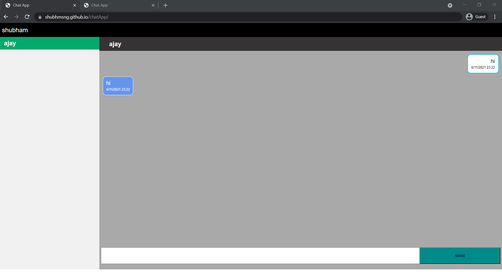

# chatApp

To try out this app, visit https://shubhmsng.github.io/chatApp.

In this application, a user has to start a session by entering a username and a password. This session will create an account for the user logging in for the first time. Then open a new browser tab and start another session by using a different username and password. When the first user refreshes the tab, the available user's list will be updated. Now, both the users can chat with each other.

This app is based on HTML5, CSS3 and vanilla javascript.

